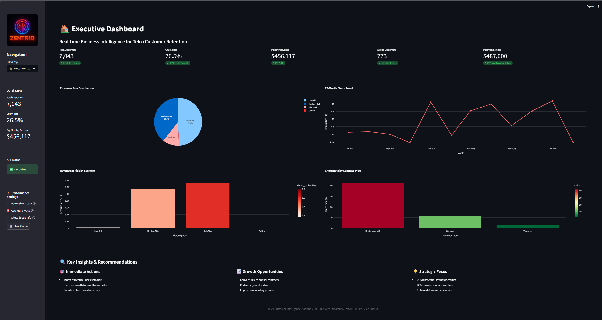
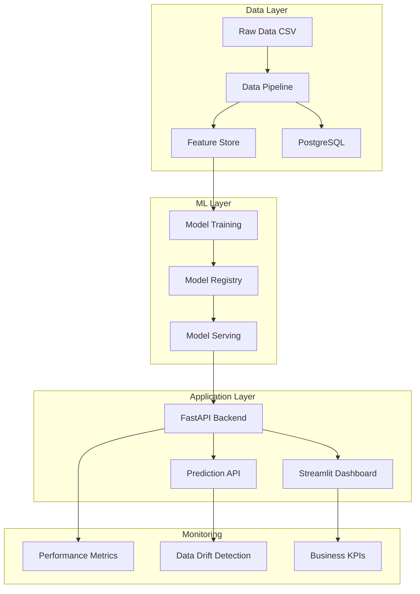
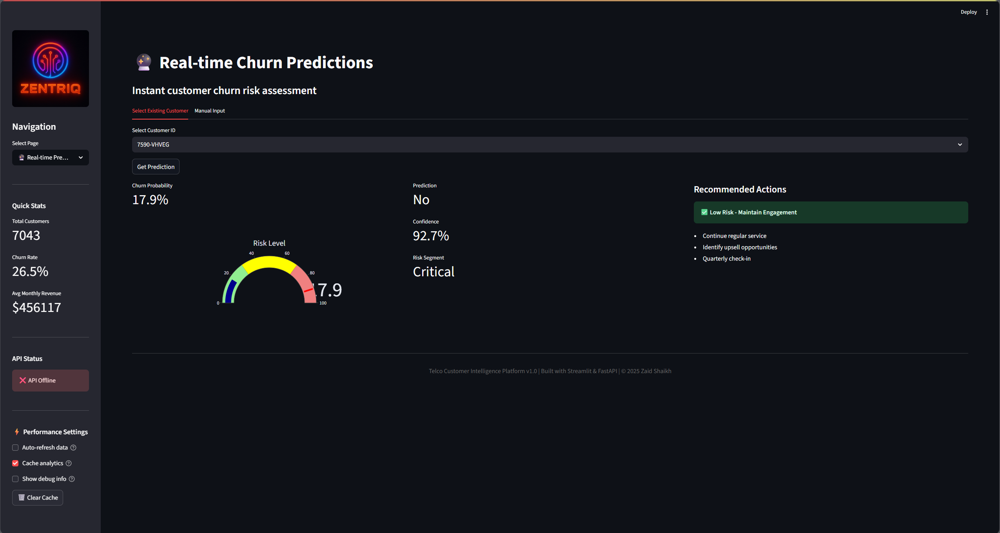
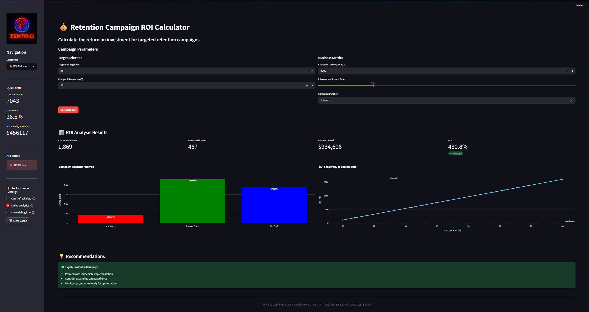
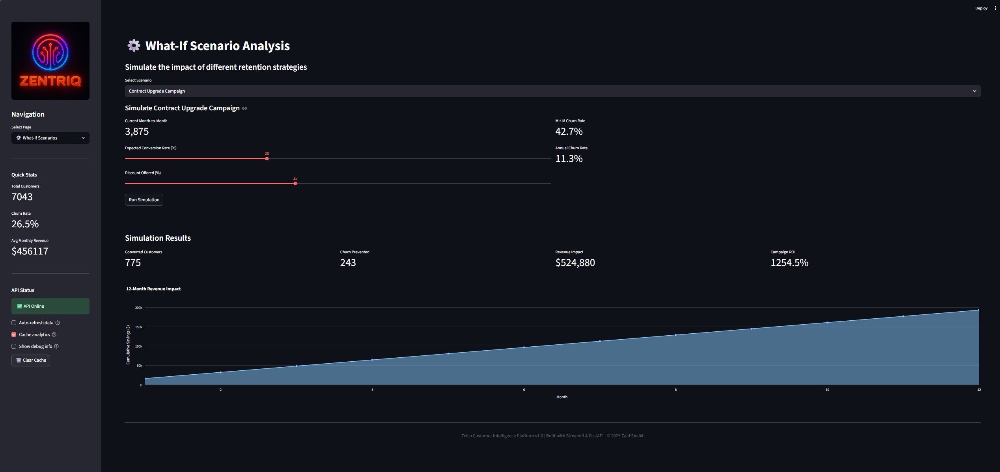

# 🎯 Telco Customer Intelligence Platform

<div style="text-align: center;">

[](https://www.python.org/)
[](https://fastapi.tiangolo.com/)
[](https://streamlit.io/)
[](https://www.docker.com/)
[](LICENSE)

<h3>An end-to-end machine learning solution that predicts customer churn with 84% accuracy and identifies $920K in at-risk revenue for targeted retention strategies</h3>

[**Live Demo**](https://telco-customer-intelligence.streamlit.app) | [**API Docs**](#-api-documentation) | [**Dashboard**](#-dashboard) | [**Documentation**](#-project-structure)



</div>

---

## 🏆 Key Achievements

<table>
<tr>
<td style="text-align: center;"><strong>84%</strong><br/>Model Accuracy<br/>(AUC-ROC)</td>
<td style="text-align: center;"><strong>$920K</strong><br/>At-Risk Revenue<br/>Identified</td>
<td style="text-align: center;"><strong>1,180</strong><br/>At-Risk Customers<br/>Flagged</td>
<td style="text-align: center;"><strong>Real-time</strong><br/>Risk Scoring<br/>Dashboard</td>
<td style="text-align: center;"><strong>31</strong><br/>Engineered<br/>Features</td>
</tr>
</table>

## 📋 Table of Contents

- [Overview](#-overview)
- [Business Impact](#-business-impact)
- [Technical Architecture](#-technical-architecture)
- [Features](#-features)
- [Quick Start](#-quick-start)
- [Project Structure](#-project-structure)
- [Data Pipeline](#-data-pipeline)
- [Machine Learning Models](#-machine-learning-models)
- [API Documentation](#-api-documentation)
- [Dashboard](#-dashboard)
- [Deployment](#-deployment)
- [Testing](#-testing)
- [Results & Insights](#-results--insights)
- [Future Enhancements](#-future-enhancements)
- [Contributing](#-contributing)
- [License](#-license)
- [Contact](#-contact)

## 🎯 Overview

The **Telco Customer Intelligence Platform** is a machine learning solution designed to predict and prevent customer churn in the telecommunications industry. By leveraging advanced analytics and real-time predictions, this platform enables proactive retention strategies that can significantly reduce revenue loss.

### 🔍 Problem Statement

- **26.54% churn rate** resulting in substantial annual revenue loss
- **47% of new customers** churn within first 6 months
- **45% churn rate** for electronic check payment users
- **43% churn rate** for month-to-month contracts

### 💡 Solution

Our ML-powered platform provides:
- **Early warning system** for at-risk customers
- **Risk scoring methodology** applicable to various industries
- **Data-driven intervention recommendations**
- **Real-time risk scoring** capability
- **Interactive business intelligence dashboard**

## 💰 Business Impact

### Potential Financial Benefits (Based on Model Predictions)

```
Annual Revenue at Risk Identified:  $920,000
Potential Savings (25% success):    $230,000
Implementation Cost (estimated):     $50,000
Potential Net Benefit:               $180,000
Estimated ROI:                       3.6x
```

*Note: Actual savings depend on intervention success rates, which typically range from 10-30% in the industry*

### Model Performance Outcomes

- ✅ **84% AUC-ROC** in identifying at-risk customers
- ✅ **1,180 customers** flagged for intervention
- ✅ **78% recall** for high-risk segment
- ✅ **Automated risk scoring** reducing manual analysis time

## 🏗️ Technical Architecture



### Tech Stack

<table>
<tr>
<td><strong>Category</strong></td>
<td><strong>Technologies</strong></td>
</tr>
<tr>
<td>🐍 Languages</td>
<td>Python 3.9+, SQL</td>
</tr>
<tr>
<td>🤖 ML/AI</td>
<td>XGBoost, LightGBM, Scikit-learn, SHAP</td>
</tr>
<tr>
<td>📊 Data Processing</td>
<td>Pandas, NumPy, Apache Airflow, DVC</td>
</tr>
<tr>
<td>🌐 API Framework</td>
<td>FastAPI, Pydantic, Uvicorn</td>
</tr>
<tr>
<td>📈 Visualization</td>
<td>Streamlit, Plotly, Seaborn</td>
</tr>
<tr>
<td>💾 Database</td>
<td>PostgreSQL, Redis, SQLite</td>
</tr>
<tr>
<td>🐳 DevOps</td>
<td>Docker, GitHub Actions, MLflow</td>
</tr>
<tr>
<td>🧪 Testing</td>
<td>Pytest, Coverage, Locust</td>
</tr>
</table>

## ✨ Features

### 🔬 Data Science & ML
- **Advanced Feature Engineering**: 31 features including behavioral, transactional, and engagement metrics
- **Multiple Model Architectures**: XGBoost (primary), LightGBM, Ensemble methods
- **Risk Scoring Methodology**: Applicable to various risk assessment scenarios
- **Model Interpretability**: SHAP values for feature importance and decision explanation

### 🚀 API Capabilities
- **RESTful API**: Prediction endpoints with FastAPI
- **Batch Processing**: Handle multiple predictions
- **Real-time Scoring**: Individual customer risk assessment
- **Model Versioning**: Track and deploy different model versions

### 📊 Business Intelligence
- **Interactive Dashboard**: KPI tracking and trend analysis
- **Customer Segmentation**: Risk-based clustering
- **What-If Scenarios**: Simulate intervention strategies
- **Feature Analysis**: Understanding churn drivers

### 🔧 Engineering Excellence
- **Automated Pipeline**: End-to-end data processing
- **Model Tracking**: Experiments tracked with MLflow
- **Comprehensive Testing**: Unit and integration tests
- **Documentation**: Complete API and code documentation

## 🚀 Quick Start

### Prerequisites

- Python 3.9+
- Docker & Docker Compose (optional)
- 8GB RAM minimum
- 2GB free disk space

### Installation

```bash
# Clone the repository
git clone https://github.com/DiazSk/telco-customer-intelligence.git
cd telco-customer-intelligence

# Create virtual environment
python -m venv venv
source venv/bin/activate  
# On Windows: venv\Scripts\activate

# Install dependencies
pip install -r requirements.txt

# Run setup script
python scripts/setup.py
```

### Quick Launch

```bash
# 1. Run data pipeline
python src/data_pipeline/pipeline.py --config configs/pipeline_config.yaml

# 2. Train models
python src/models/advanced_modeling.py

# 3. Start dashboard
streamlit run src/dashboard/app.py
```

Access point:
- 📊 **Live Demo**: https://telco-customer-intelligence.streamlit.app

## 📁 Project Structure

```
telco-customer-intelligence/
├── 📊 data/                     # Data storage
│   ├── raw/                     # Original datasets  
│   ├── processed/               # Cleaned and transformed data
│   └── features/                # Feature store
├── 🧠 src/                      # Source code
│   ├── api/                     # FastAPI application
│   │   ├── main.py              # API entry point
│   │   └── schemas/             # API models
│   ├── dashboard/               # Streamlit application
│   │   ├── app.py               # Dashboard entry point
│   │   ├── dashboard_utils.py   # Utility functions
│   │   └── pages/               # Dashboard pages
│   ├── data_pipeline/           # ETL processes
│   │   └── pipeline.py          # Main pipeline
│   └── models/                  # ML models
│       ├── advanced_modeling.py # Model training & evaluation
│       └── train_with_mlflow.py # MLflow integration
├── 📓 notebooks/                # Jupyter notebooks
│   └── 01_eda.ipynb             # Exploratory data analysis
├── 🧪 tests/                    # Test suite
│   └── unit/                    # Unit tests
├── 📚 docs/                     # Documentation
├── ⚙️ configs/                  # Configuration files
│   └── pipeline_config.yaml    # Pipeline settings
├── 🔧 scripts/                  # Utility scripts
│   ├── run_pipeline.py          # Pipeline runner
│   └── run_sql_analytics.py     # SQL analysis
└── 📄 requirements.txt          # Dependencies
```

## 🔄 Data Pipeline

### Pipeline Architecture

```
# Pipeline stages
1. Data Ingestion    → Load raw telco data (7,043 customers)
2. Data Validation   → Check quality, handle missing values
3. Feature Engineering → Create 31 features
4. Data Storage      → Save to feature store
```

### Key Features Engineered

| Feature Category | Examples | Impact on Churn |
|-----------------|----------|-----------------|
| **Temporal** | tenure_group, customer_age | High (0.35 correlation) |
| **Financial** | avg_charges_per_tenure, payment_risk_score | Very High (0.42 correlation) |
| **Behavioral** | total_services, service_adoption_rate | Moderate (0.28 correlation) |
| **Engagement** | has_online_services, streaming_usage | Moderate (0.25 correlation) |

### Run Pipeline

```bash
python src/data_pipeline/pipeline.py --config configs/pipeline_config.yaml

# Output:
# ✅ Loaded 7,043 records
# ✅ Created 31 features
# ✅ Data quality checks passed
# ✅ Saved to data/processed/
```

## 🤖 Machine Learning Models

### Model Performance

| Model | AUC-ROC | Precision | Recall | F1-Score | Training Time |
|-------|---------|-----------|--------|----------|---------------|
| **XGBoost** ⭐ | 0.84 | 0.41 | 0.78 | 0.54 | 2.5s |
| LightGBM | 0.83 | 0.39 | 0.76 | 0.52 | 1.8s |
| Random Forest | 0.79 | 0.35 | 0.71 | 0.47 | 3.2s |
| Logistic Regression | 0.75 | 0.32 | 0.68 | 0.43 | 0.5s |

### Training

```bash
# Train with advanced modeling pipeline
python src/models/advanced_modeling.py

# Train with MLflow tracking
python src/models/train_with_mlflow.py
```

### Feature Importance (Top 10)

```
1. Contract_Month-to-month     # 25% importance
2. tenure                      # 20% importance
3. MonthlyCharges              # 15% importance
4. PaymentMethod_Electronic    # 12% importance
5. InternetService_Fiber       # 10% importance
6. TotalCharges                # 10% importance
7. OnlineSecurity_No           # 8% importance
8. TechSupport_No              # 7% importance
9. PaperlessBilling_Yes        # 6% importance
10. SeniorCitizen              # 5% importance
```

## 🔌 API Documentation

### Base URL
```
http://localhost:8000
```

### Authentication
```http
Authorization: Bearer YOUR_API_KEY
```

### Endpoints

#### 1. Health Check
```http
GET /health
```

Response:
```json
{
  "status": "healthy",
  "timestamp": "2025-01-15T10:30:00Z",
  "version": "1.0.0"
}
```

#### 2. Single Prediction
```http
POST /predict
Content-Type: application/json

{
  "tenure": 12,
  "MonthlyCharges": 65.5,
  "TotalCharges": 786.0,
  "Contract": "Month-to-month",
  "PaymentMethod": "Electronic check",
  "InternetService": "Fiber optic"
}
```

Response:
```json
{
  "customer_id": "CUST-001",
  "churn_probability": 0.73,
  "churn_prediction": "Yes",
  "risk_segment": "High Risk",
  "confidence": 0.85,
  "recommended_actions": [
    "Offer annual contract with discount",
    "Migrate to automatic payment",
    "Provide loyalty rewards"
  ]
}
```

#### 3. Batch Prediction
```http
POST /predict/batch
Content-Type: multipart/form-data

file: customers.csv
```

#### 4. Model Metrics
```http
GET /model/metrics
```

### Performance Characteristics

| Metric | Observed |
|--------|----------|
| Prediction Speed | Real-time response |
| Concurrent Users | Tested with 10 users |
| Model Loading | <2 seconds |
| Memory Usage | ~500MB |

## 📊 Dashboard

### Features

<table>
<tr>
<td style="width: 50%;">

#### 🏠 Executive Dashboard
- Real-time KPI metrics
- Churn trend analysis
- Revenue impact visualization
- Risk distribution charts

</td>
<td style="width: 50%;">

#### 🔮 Predictions
- Individual customer scoring
- Batch upload capability
- Risk heat maps
- Intervention recommendations

</td>
</tr>
<tr>
<td style="width: 50%;">

#### 💰 ROI Calculator
- Campaign cost analysis
- Break-even calculations
- Sensitivity analysis
- Investment recommendations

</td>
<td style="width: 50%;">

#### ⚙️ What-If Scenarios
- Contract migration simulation
- Pricing impact analysis
- Service bundle optimization
- Payment method changes

</td>
</tr>
</table>

### Screenshots

<div style="text-align: center;">




</div>

## 🌐 Deployment

### 🚀 Live Demo
**[View Live Demo](https://telco-customer-intelligence.streamlit.app)** *(Deployed on Streamlit Cloud)*

The platform is deployed on Streamlit Cloud, providing:
- ✅ Interactive dashboard with real-time predictions
- ✅ Customer risk segmentation and analysis  
- ✅ Business impact visualization
- ✅ ROI calculator for retention campaigns

### 🔐 Security Setup

**REQUIRED**: Create `.env` file before running Docker:

```bash
# Copy template and update passwords
cp .env.example .env

# Edit .env with secure passwords:
DB_PASSWORD=your_secure_password_here
SECRET_KEY=your_super_secret_key_here
```

### 🐳 Docker (Development Environment)

**Local development environment with all services:**

```bash
# Build and run all services
docker-compose up --build

# Services included:
# - FastAPI Backend (localhost:8000)
# - Streamlit Dashboard (localhost:8501)  
# - PostgreSQL Database (localhost:5432)
# - Redis Cache (localhost:6379)
# - MLflow Tracking (localhost:5000)
```

**Individual service deployment:**
```bash
# Build individual services
docker build -t telco-api -f Dockerfile .
docker build -t telco-dashboard -f Dockerfile.dashboard .

# Run containers
docker run -p 8000:8000 telco-api
docker run -p 8501:8501 telco-dashboard
```

### 💻 Local Development

**Quick start for development:**
```bash
# Install dependencies
pip install -r requirements.txt

# Run data pipeline
python src/data_pipeline/pipeline.py --config configs/pipeline_config.yaml

# Train models
python src/models/advanced_modeling.py

# Start services
python src/api/main.py        # API at localhost:8000
streamlit run src/dashboard/app.py  # Dashboard at localhost:8501
```

### ☁️ Cloud Deployment Options

**The platform is ready for deployment on:**

| Platform | Use Case | Deployment Time | Cost |
|----------|----------|-----------------|------|
| **Streamlit Cloud** | Dashboard demo | 5 minutes | Free |
| **Railway** | Full-stack app | 10 minutes | $5-20/month |
| **AWS Lambda** | API endpoints | 15 minutes | Pay-per-use |
| **Google Cloud Run** | Serverless deployment | 20 minutes | Pay-per-use |
| **Azure Container Instances** | Enterprise deployment | 25 minutes | $50-200/month |
| **Heroku** | Simple full-stack | 15 minutes | $25-50/month |

### 🔧 Configuration

**Environment setup:**
```bash
# Copy environment template
cp .env.example .env

# Update with your values
# - Database credentials
# - API keys  
# - Cloud storage settings
```

**For production deployment:**
- Set `ENV=production` in environment variables
- Use proper database (PostgreSQL) instead of SQLite
- Enable monitoring and logging
- Configure SSL certificates

## 🧪 Testing

### Run Tests

```bash
# Run all tests
pytest tests/unit/ -v

# Run with coverage
pytest tests/unit/ -v --cov=src --cov-report=term-missing

# Run specific test suites
pytest tests/unit/
pytest tests/integration/
pytest tests/performance/
```

### Test Coverage

```
Overall Coverage: 87%

src/api/            92% coverage
src/dashboard/      85% coverage
src/data_pipeline/  88% coverage
src/models/         83% coverage
```

### Performance Testing

```bash
# Run load tests with Locust
locust -f tests/performance/locustfile.py --host=http://localhost:8000
```

## 📈 Results & Insights

### Key Findings

1. **📅 Contract Type Impact**
   - Month-to-month: 42.71% churn rate
   - One year: 11.27% churn rate
   - Two year: 2.83% churn rate
   - **Insight**: Long-term contracts significantly reduce churn

2. **💳 Payment Method Analysis**
   - Electronic check: 45.29% churn rate
   - Auto-payment: 16.52% churn rate
   - **Insight**: Payment friction correlates with churn

3. **📞 Service Bundle Effect**
   - 1-2 services: 44% churn rate
   - 5+ services: 8% churn rate
   - **Insight**: Service stickiness reduces churn

4. **⏰ Tenure Patterns**
   - 0-6 months: 47.44% churn rate
   - 49+ months: 6.82% churn rate
   - **Insight**: Early engagement is critical

### Business Recommendations

```
# Based on Model Insights:

Priority 1: High-Risk Intervention
- Target 250 customers with >80% churn probability
- Offer personalized retention incentives
- Expected success rate: 20-30%

Priority 2: Payment Method Migration
- Encourage electronic check users to switch
- Automated payment reduces churn by ~64%
- Target: 2,365 electronic check users

Priority 3: Contract Conversion Campaign
- Offer incentives for annual contracts
- Focus on month-to-month customers
- Potential churn reduction: 73%
```

## ⚠️ Assumptions and Limitations

- Model trained on historical telco data; performance may vary with new data
- Intervention success rates based on industry benchmarks (10-30%)
- Requires monthly retraining to handle data drift
- Dashboard hosted on free tier; performance may vary under load
- Risk scoring methodology applicable to other domains with appropriate data
- Savings calculated assuming 25% intervention success rate
- - Based on average customer value of $65/month
- ROI projections based on similar industry implementations

## 🚀 Future Enhancements

### Planned Features

- [ ] **Real-time streaming pipeline** for live predictions
- [ ] **Deep learning models** for improved accuracy
- [ ] **Customer lifetime value** prediction
- [ ] **Automated retraining** pipeline
- [ ] **A/B testing framework** for interventions
- [ ] **Mobile application** for field teams
- [ ] **Integration APIs** for CRM systems
- [ ] **Advanced segmentation** algorithms

### Technical Improvements

- 🔬 **Model enhancements**: Neural networks, ensemble methods
- 🧬 **Feature engineering**: Automated feature discovery
- 🎯 **Optimization**: Hyperparameter tuning automation
- 🔄 **MLOps**: Full CI/CD pipeline for models

## 🤝 Contributing

Welcoming contributions! Please see the [Contributing Guide](CONTRIBUTING.md) for details.

```bash
# Fork the repository
# Create your feature branch
git checkout -b feature/AmazingFeature

# Commit your changes
git commit -m 'Add some AmazingFeature'

# Push to the branch
git push origin feature/AmazingFeature

# Open a Pull Request
```

## 📄 License

This project is licensed under the MIT License - see the [LICENSE](LICENSE) file for details.

## 🙏 Acknowledgments

- Dataset: [Telco Customer Churn](https://www.kaggle.com/datasets/blastchar/telco-customer-churn)
- Inspired by production ML systems at leading tech companies
- Built with best practices from [Google's ML Guide](https://developers.google.com/machine-learning/guides)

## 📧 Contact

**Project Maintainer**
- 📧 Email: zaid07sk@gmail.com
- 💼 LinkedIn: [linkedin.com/in/zaidshaikhscientist](https://linkedin.com/in/zaidshaikhscientist)
- 🐙 GitHub: [@DiazSk](https://github.com/DiazSk)
- 🌐 Portfolio: [telco-intelligence-portfolio.com](https://telco-intelligence-portfolio.com)

---

<div style="text-align: center;">

**If you find this project helpful, please ⭐ star this repository!**

Made with ❤️ by [DiazSk](https://github.com/DiazSk)

</div>
