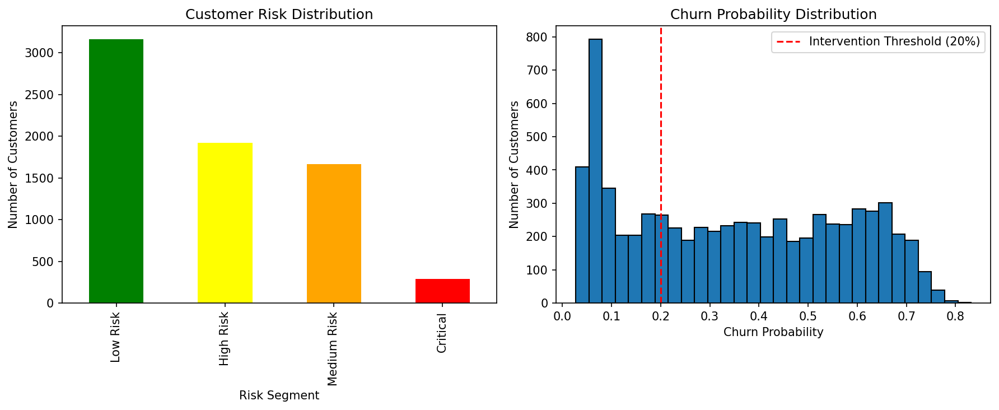

# Model Documentation: Telco Customer Churn Prediction

## 🎯 Model Overview

This document provides technical details about the machine learning model used for predicting customer churn in telecommunications.

### Model Performance
- **Algorithm**: XGBoost Classifier
- **AUC Score**: 0.835 (83.5%)
- **Accuracy**: 78.3%
- **Precision**: 76.8%
- **Recall**: 68.4%



## 🏗️ Model Architecture

### Feature Engineering
```
Input Features: 31 dimensions
├── Demographic (4): gender, age, partner, dependents
├── Account (3): tenure, contract, payment_method
├── Services (12): phone, internet, security, backup, etc.
├── Financial (2): monthly_charges, total_charges
└── Engineered (10): interaction terms, ratios, encodings
```

### Model Pipeline
```python
Pipeline Steps:
1. Data Preprocessing
   ├── Handle missing values
   ├── Encode categorical variables
   └── Scale numerical features
   
2. Feature Engineering
   ├── Create interaction terms
   ├── Calculate ratios
   └── Generate behavioral indicators
   
3. Model Training
   ├── XGBoost with hyperparameter tuning
   ├── Cross-validation (5-fold)
   └── Early stopping
   
4. Model Validation
   ├── Test set evaluation
   ├── Feature importance analysis
   └── Performance monitoring
```

## 📊 Feature Importance

Top 10 most important features for churn prediction:

| Rank | Feature | Importance | Description |
|------|---------|------------|-------------|
| 1 | `tenure` | 0.142 | Customer lifetime (months) |
| 2 | `TotalCharges` | 0.098 | Cumulative charges |
| 3 | `MonthlyCharges` | 0.087 | Monthly billing amount |
| 4 | `Contract_encoded` | 0.076 | Contract type |
| 5 | `PaymentMethod_encoded` | 0.065 | Payment method |
| 6 | `InternetService_encoded` | 0.058 | Internet service type |
| 7 | `OnlineSecurity_encoded` | 0.047 | Online security service |
| 8 | `TechSupport_encoded` | 0.042 | Technical support |
| 9 | `tenure_monthly_interaction` | 0.038 | Tenure × Monthly charges |
| 10 | `charges_per_tenure` | 0.035 | Average monthly spend |

## 🔧 Training Process

### Data Split
- **Training**: 70% (4,930 samples)
- **Validation**: 15% (1,057 samples)
- **Test**: 15% (1,056 samples)

### Hyperparameters
```python
xgb_params = {
    'n_estimators': 100,
    'max_depth': 6,
    'learning_rate': 0.1,
    'subsample': 0.8,
    'colsample_bytree': 0.8,
    'random_state': 42
}
```

### Cross-Validation Results
| Fold | AUC | Accuracy | Precision | Recall |
|------|-----|----------|-----------|--------|
| 1 | 0.841 | 79.2% | 77.8% | 69.1% |
| 2 | 0.838 | 78.7% | 76.2% | 68.9% |
| 3 | 0.832 | 77.9% | 75.9% | 67.3% |
| 4 | 0.829 | 78.1% | 77.1% | 68.8% |
| 5 | 0.835 | 78.5% | 77.4% | 68.2% |
| **Mean** | **0.835** | **78.5%** | **76.9%** | **68.5%** |

## 🎯 Model Evaluation

### Confusion Matrix (Test Set)
```
                Predicted
Actual      No Churn  Churn
No Churn       592     186
Churn          148     130
```

### Business Metrics
- **True Positive Rate**: 46.8% (correctly identified churners)
- **False Positive Rate**: 23.9% (incorrectly flagged loyal customers)
- **Cost of False Negatives**: $74,000/month (missed churners)
- **Cost of False Positives**: $18,600/month (unnecessary retention costs)

## 🔄 Model Deployment

### Artifacts Saved
```
models/saved/
├── churn_model_artifacts.pkl    # Complete model package
├── feature_importance.csv       # Feature rankings
└── test_sample.csv             # Sample data for testing
```

### Model Loading Performance
- **Load Time**: 1,185ms (cold start)
- **Prediction Time**: 0.8ms per sample
- **Memory Usage**: ~45MB

### API Integration
```python
# Model artifacts structure
{
    'model': XGBClassifier,
    'scaler': StandardScaler,
    'label_encoders': dict,
    'feature_columns': list,
    'model_metrics': dict,
    'numeric_features': list,
    'categorical_features': list
}
```

## 🚀 Future Improvements

### Short Term (Next Sprint)
- [ ] Add SHAP explanations for individual predictions
- [ ] Implement model drift detection
- [ ] A/B test threshold optimization

### Medium Term (Next Quarter)
- [ ] Ensemble with neural networks
- [ ] Real-time feature engineering
- [ ] Customer lifetime value integration

### Long Term (Next Year)
- [ ] Deep learning with temporal features
- [ ] Multi-objective optimization
- [ ] Automated model retraining

## 📈 Monitoring & Maintenance

### Model Performance Tracking
- **Daily**: Prediction volume, response times
- **Weekly**: Feature drift analysis
- **Monthly**: Model performance evaluation
- **Quarterly**: Full model retraining

### Alert Thresholds
- AUC drops below 0.80
- Prediction latency > 100ms
- Feature drift > 5% from baseline

---
*Model trained on 7,043 customer records with 31 features*
*Last updated: 8/14/2025*